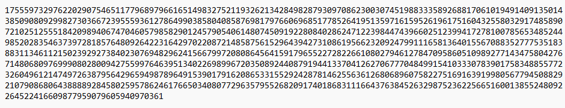
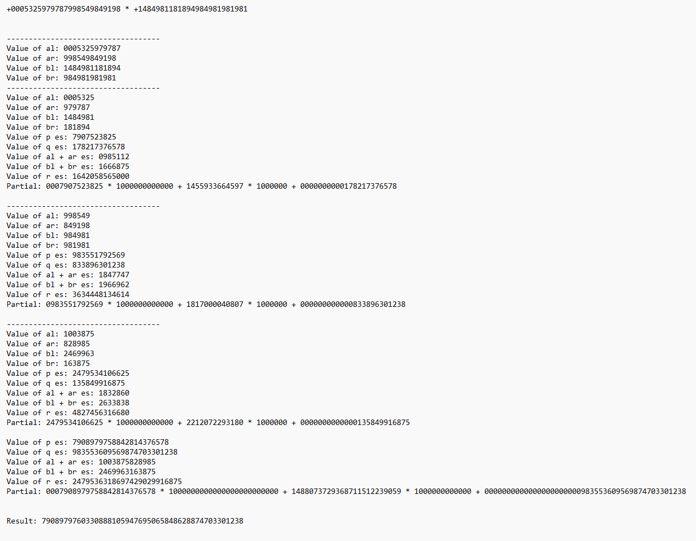

# Multiplying big numbers

## Introducción
La multiplicación de grandes números está limitada por el tamaño de representación de los valores en los diversos lenguajes de programación, así que, en el caso de exceder el tamaño máximo hay que buscar otras técnicas. En esta implementación, se plantea la realización de un algoritmo que multiplique estos números enteros más allá del tamaño de los tipos enteros de Java, para ello, se usa un enfoque de programación *Divide y Vencerás*.

## Instrucciones
Para usar el programa, se copia el archivo *Multiply.jar* en una carpeta a elección del usuario. A continuación, se abre el terminal del sistema operativo, se navega hasta la ubicación de la carpeta donde se copió el archivo con extensión .jar y se ejecuta el archivo mediante la siguiente sintáxis:

* `multiply.jar [-t] [-h] [fichero_entrada] [fichero_salida]`

Los argumentos son los siguientes:
* `-t`: Traza cada paso de manera que se describa la descomposición en sub-números.
* `-h`: Muestra la ayuda y sintaxis del comando de ejecución.

Opciones posibles:
* `java -jar multiply.jar -h`
* `java -jar multiply.jar fichero_entrada`
* `java -jar multiply.jar -t fichero_entrada`
* `java -jar multiply.jar -t fichero_entrada fichero_salida`
* `java -jar multiply.jar fichero_entrada fichero_salida`

*Consideraciones*:
* El fichero de entrada consiste en dos valores separados por uno o más espacios o por saltos de línea. Además, los valores pueden tener un signo "+" o "-". No se permiten dos signos o espacios consecutivos antes del primer valor dado.

* Los archivos de entrada y salida deben tener la extensión .txt; de lo contrario, la aplicación generará un error.

* El límite de números que se pueden multiplicar es de dos números de 2000 dígitos cada uno. Si alguno de ellos tiene más dígitos, la aplicación generará un error.

## Imágenes de muestra
A continuación, se pueden ver unas imágenes de muestra del programa.

* Ejemplo de salida de la solución por la terminal del sistema operativo.

  

* Ejemplo de salida de la solución en un archivo de salida.

* Ejemplo de traza de una solución.

## Licencia
Este proyecto está licenciado bajo la Licencia Pública General GNU v3 (GPLv3).

© 2025 Roberto Castillejo Embid. 
Consulte el archivo [LICENSE](./LICENSE) para más detalle.
